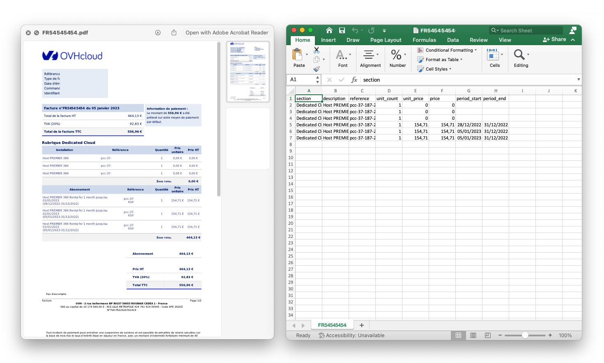

# ovh-invoices-parser

Transform OVH PDF invoices to proper CSV files.



## install dependencies

```bash
python3 -m venv .venv
source .venv/bin/activate
pip install -r requirements.txt
```

## usage

1. Copy the PDF invoices in the input directory
2. Run the script. The processed data will be available in the output folder. A global report will be written in the `output/report.csv` file.

```
./ovh-invoices-parser.py
```


## todo
- [ ] support english language